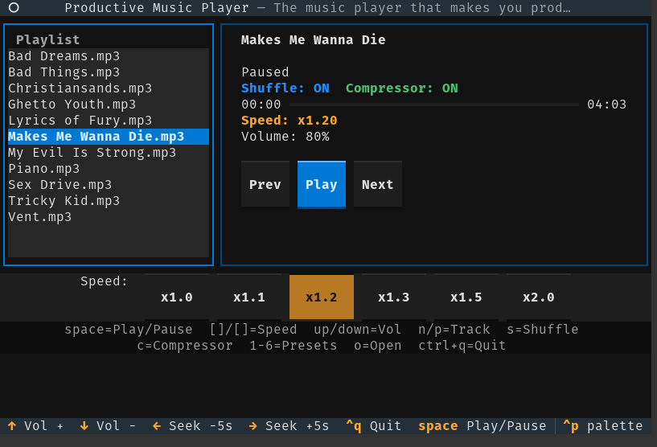

# Productive Music Player

A terminal music player with playback speed control. Speed up your music to stay productive.



## Requirements

- Python 3.10+
- VLC media player

## Install VLC

**Windows**: Download from https://www.videolan.org/vlc/ and install.

**Mac**: `brew install vlc` or download from https://www.videolan.org/vlc/

**Linux**: `sudo apt install vlc` (Ubuntu/Debian) or `sudo dnf install vlc` (Fedora)

## Setup

```
pip install -r requirements.txt
```

Put your music files (.mp3, .flac, .ogg, .wav, etc.) in the `music` folder.

## Run

```
python productivemusicplayer.py
```

To load a different folder:

```
python productivemusicplayer.py myfolder
```

## Controls

| Key | Action |
|---|---|
| Space | Play / Pause |
| N / P | Next / Previous track |
| Up / Down | Volume up / down |
| ] / [ | Speed +0.05 / -0.05 |
| } / { | Speed +0.2 / -0.2 |
| 1-6 | Speed presets (1.0x, 1.1x, 1.2x, 1.3x, 1.5x, 2.0x) |
| Right / Left | Seek +5s / -5s |
| S | Toggle shuffle |
| C | Toggle compressor |
| Ctrl+Q | Quit |
